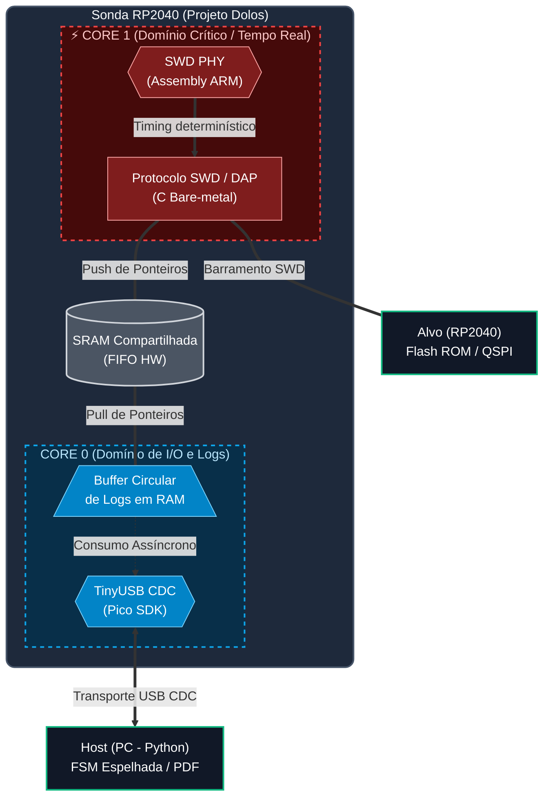

# Projeto Dolos — SWD Forensic Extractor

-blue)

-00599C?logo=c)


> Ferramenta de aquisição bare-metal que extrai e valida o conteúdo da memória Flash de um RP2040 alvo via protocolo SWD, usando outro RP2040 como sonda.

---

## O que é este projeto

O **Dolos** transforma um Raspberry Pi Pico (Sonda) em um extrator forense capaz de adquirir **2 MB de firmware em menos de 60 segundos**, com validação criptográfica SHA-256 e registro estruturado da sessão, sem depender de nenhuma ferramenta de debug convencional (CMSIS-DAP, OpenOCD, picotool).

O diferencial não está apenas em implementar SWD sem biblioteca pronta. Está em tratar a extração como uma **"operação forense"**: integridade verificável, política explícita de não-modificação do alvo e evidência auditável do processo.

### Origem

Este projeto é continuação direta de uma fase de pesquisa onde o RP2040 foi controlado sem nenhuma abstração de SDK, boot manual, clock tree manual, GPIO e UART via MMIO direto. Essa fase estabeleceu a base técnica para as decisões de arquitetura aqui tomadas.

→ **[Ver Fase 0: uart-baremetal-rp2040](https://github.com/StheffannyNAlves/uart-baremetal-rp2040)**

---

## Status

### Fase 1 — Concluída

Fundação da sonda validada: ambiente de build, firmware modular, USB CDC funcional e controle do alvo.

- [x] Ambiente CMake + TinyUSB configurado
- [x] Firmware inicial modular com FSM mínima (ST_BOOT → ST_IDLE)
- [x] Controle do pino RUN do alvo via GPIO
- [x] USB CDC enumerado e validado com echo PC ↔ Sonda
- [x] Comandos básicos de controle recebidos e respondidos via USB

### Fase 2 — Em andamento

Implementação da camada física SWD em assembly ARM via SIO e início da camada de protocolo.

- [x] `swd_phy_init` — inicialização de GPIO_OE e estado inicial dos pinos
- [x] `writebit` — transmissão determinística de 1 bit via SIO, timing calibrado por NOPs
- [x] `readbit` — leitura de 1 bit com chaveamento de direção via GPIO_OE
- [x] `turnaround_host_to_target` e `turnaround_target_to_host`
- [x] `line_reset` — 50 ciclos HIGH via loop assembly
- [x] `swd_enter_swd_mode` — sequência completa: line_reset → 0xE79E → line_reset → idle cycles
- [ ] Validação no analisador lógico
- [ ] Leitura do IDCODE
- [ ] Navegação DAP

---

## Arquitetura

O projeto adota uma arquitetura híbrida onde cada camada tem uma justificativa técnica explícita.



### Decisões de design

**Por que bit-banging em Assembly e não PIO ou C?**
  O pino `SWDCLK` opera de forma simétrica com atrasos calculados ciclo a ciclo via `NOPs`. Implementar em C delegaria o timing ao compilador, gerando instabilidade. O PIO automatizaria o processo, mas a implementação em Assembly ARM puro garante o controle cirúrgico e o determinismo necessários para auditoria forense.
**Por que isolamento multicore (Core 1 vs Core 0)?**
  Rotinas de exibição ou stacks de comunicação (como TinyUSB) possuem latências imprevisíveis de milissegundos. No Core 1, o barramento roda com **zero interrupções** e acesso exclusivo aos pinos via bloco **SIO (Single-cycle IO)** conectado ao barramento IOPORT do Cortex-M0+, garantindo escritas atômicas e livres de jitter de crossbar.
**Por que o pino RUN é controlado sob Reset?**
  Ao segurar a linha `RUN` do alvo em LOW antes da inicialização, a sonda impede o processador alvo de executar código local malicioso ou de reconfigurar os registradores do subsistema QSPI, assumindo o controle do silício a partir de um estado virgem e previsível.

---

## Robustez e Tratamento de Erros (LUT)

O gerenciamento de falhas do sistema é centralizado em uma **Look-Up Table (LUT) estática** armazenada em Flash. Toda transição de erro na FSM passa obrigatoriamente pela função unificada `error_policy(code)`.

As falhas são categorizadas por severidade, disparando reações determinísticas imediatas:
-`ACTION_RETRY`: Reexecução de operações (ex: colisões de `ACK_WAIT`).
-`ACTION_ABORT`: Encerramento seguro da sessão preservando os dados coletados até o momento.
-`ACTION_FATAL_HALT`: Paralisação imediata da sonda com liberação do pino `RUN` do alvo em HIGH (mecanismo de *Safety Net* contra travamentos).

---

## Política de integridade: Safe-Read

A sonda opera sob um modelo de **Safe-Read forçado por software**. Após o handshake inicial e a configuração estrita do subsistema QSPI/XIP do alvo, o firmware bloqueia qualquer envio de payloads de escrita. Qualquer tentativa de desvio ou comando não autorizado aborta a sessão imediatamente (`ST_ABORT`), invalidando o token de sessão criptográfico gerado no boot.

---

## Hardware

### Componentes

- 2× Raspberry Pi Pico
- 1× Resistor 330 Ω
- 1× Resistor 1 kΩ
- Analisador lógico (ex: Hantek 6022BL com DSView)
- Protoboard e jumpers

### Ligação Sonda → Alvo

| Sinal | GPIO Sonda | Componente | Pino Alvo | Função |
| :------ | :---------- | :----------- | :---------- | :------- |
| SWCLK | `GP2` | Cabo JST SH 1.00mm | `SWCLK` | Clock SWD —> sempre saída |
| SWDIO | `GP3` | Cabo JST SH 1.00mm + Resistor **330 Ω** série | `SWDIO` | Dados bidirecionais |
| RESET | `GP22` | Resistor **1 kΩ** série | `RUN` (pino 30) | Kill switch |
| GND | `GND` | Cabo JST SH 1.00mm | `GND` | Referência comum —> obrigatório |

---

## Como compilar

### Requisitos

| Ferramenta | Versão |
| ------------ | -------- |
| `arm-none-eabi-gcc` | 13.2 |
| CMake | ≥ 3.13 |
| [Pico SDK](https://github.com/raspberrypi/pico-sdk) | em `PICO_SDK_PATH` |

### Build

```bash
git clone https://github.com/StheffannyNAlves/swd-forensic-extractor.git
cd swd-forensic-extractor/firmware

mkdir build && cd build
cmake ..
make -j$(nproc)
```

Para flashar: segure BOOTSEL no Pico sonda, conecte o USB e copie `dolos.uf2` para o drive que aparecer.

---

## Referências

- [RP2040 Datasheet](https://datasheets.raspberrypi.com/rp2040/rp2040-datasheet.pdf) — §2.3.1 (SIO), §4.7 (Watchdog)
- [ARM ADIv5 Architecture Specification](https://developer.arm.com/documentation/ihi0031/latest) — protocolo SWD
- [ARMv6-M Architecture Reference Manual](https://developer.arm.com/documentation/ddi0419/latest) — DHCSR, Cortex-M0+
- [TinyUSB](https://github.com/hathach/tinyusb) — stack USB CDC

---

*Desenvolvido por [Stheffanny N. Alves](https://github.com/StheffannyNAlves)*
